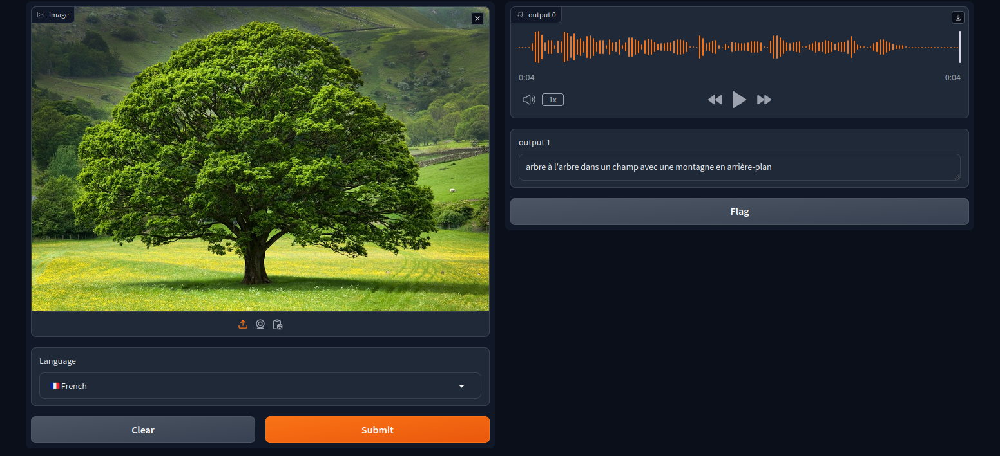

# Audio Generation from Image Tool

## Overview
Welcome to the Audio Generation from Image Tool! This tool combines advanced image captioning and text-to-speech technologies to provide an immersive audiovisual experience. It analyzes uploaded images, generates captions, and converts them into audio in a language of your choice. Dive into the realm of AI-generated audiovisual experiences with this powerful tool.

## Features
- **Seamless Integration**: Seamlessly combines image captioning and text-to-speech technologies.
- **Language Support**: Supports multiple languages for both input images and generated audio.
- **High-Quality Audio**: Delivers high-quality audio outputs with remarkable accuracy and clarity.
- **Customizable Experience**: Choose from various languages to generate audio, offering a personalized experience.
- **Cutting-Edge AI Models**: Powered by advanced AI models like Salesforce's "blip-image-captioning-large" and Facebook's "seamless-m4t-v2-large".

## Instructions
1. **Upload Image**: Upload an image you want to generate audio from.
2. **Select Language**: Choose the language of the image caption and the language for the generated audio.
3. **Generate Audio**: Click on the generate button to produce audio from the image caption.

## Supported Languages
- 🇺🇸 English
- 🇮🇷 Persian
- 🇷🇺 Russian
- 🇫🇷 French
- 🇩🇪 German
- 🇪🇸 Spanish
- 🇹🇷 Turkish
- 🇯🇵 Japanese
- 🇮🇹 Italian
- 🇰🇷 Korean

## Interface View

*Screenshot of the interface showing the image upload and language selection*

## Usage
Explore new dimensions of visual content, enhance language skills, engage audiences with captivating multimedia presentations, and immerse yourself in the world of AI-generated audiovisual experiences.

## Dependencies
- [Gradio](https://www.gradio.app/)
- [Scipy](https://www.scipy.org/)
- [Pillow (PIL)](https://python-pillow.org/)
- [Transformers](https://huggingface.co/transformers/)
